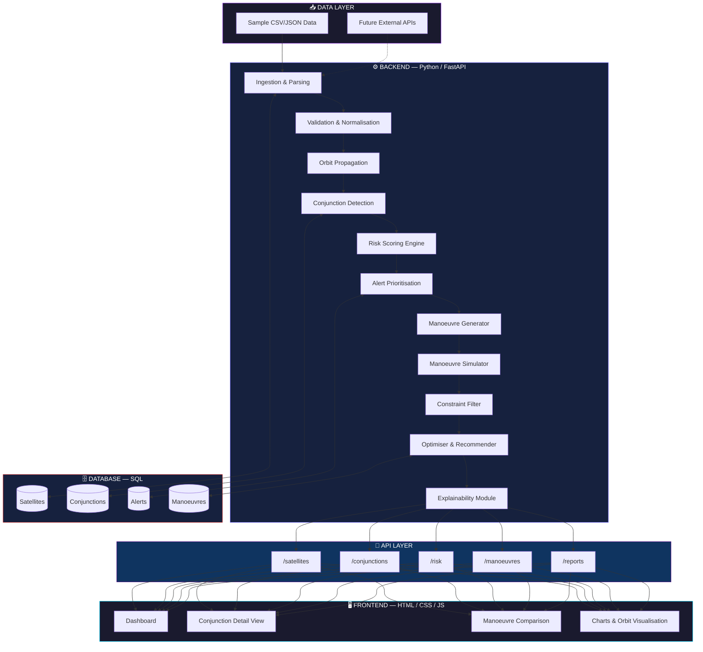

<div align="center">

# 🛰️ CELESTIQ

### *Intelligent Collision-Avoidance Decision Support & Manoeuvre Optimisation Engine*


<br/>


<br/><br/>

*A decision-support prototype that analyses orbital conjunctions, quantifies collision risk,*
*and recommends optimised, feasible avoidance manoeuvres — through a clean, explainable, data-driven pipeline.*

<br/>

[Overview](#-project-overview) •
[Features](#-core-capabilities) •
[Architecture](#-system-architecture) •
[Tech Stack](#-technology-stack) •
[Installation](#-installation--setup) •
[API](#-api-reference) •
[Team](#-team--ownership) •
[Roadmap](#-future-roadmap)

</div>

<br/>

> ⚠️ **DISCLAIMER — READ FIRST**
> Celestiq is an **educational and research prototype**. It does **not** autonomously control any spacecraft and must **never** be used as a substitute for official, validated conjunction-assessment services. All outputs are for learning, demonstration, and algorithm experimentation only. Real mission operations must rely exclusively on authoritative data and qualified mission operators.

---

<br/>

## 🌌 Project Overview

As Low Earth Orbit becomes increasingly congested with active satellites and debris, the need for accessible, explainable, and intelligent conjunction-analysis tooling has never been greater. **Celestiq** is a full-stack prototype built to simulate — end-to-end — how a modern satellite operator might triage collision risk and evaluate avoidance strategies.

The system ingests orbital data, propagates future trajectories, detects predicted close approaches, scores risk transparently, generates candidate avoidance manoeuvres, simulates their consequences, and recommends the optimal feasible option — all surfaced through a polished, responsive web dashboard.

<div align="center">

| 🎯 Precision | 🧠 Explainability | ⚡ Speed | 🖥️ Clarity |
|:---:|:---:|:---:|:---:|
| Transparent risk scoring built from weighted, documented factors | Every recommendation ships with the "why" behind it | Lightweight Python core designed for rapid iteration | Dashboard-first UX for fast operator comprehension |

</div>

<br/>

---

## 🎯 Project Goals

<table>
<tr>
<td width="50%" valign="top">

### Primary Objectives
- 🏗️ Clean, modular software architecture for conjunction analysis
- 📊 Consistent, validated orbital data processing pipeline
- 🛰️ Predicted close-approach detection
- 📈 Transparent, understandable risk scoring
- 🚨 Intelligent alert prioritisation
- 🔀 Multi-candidate manoeuvre generation & comparison
- 🖥️ Accessible, real-time dashboard
- 💡 Full explainability layer
- 🎬 Reliable demo scenario for presentations

</td>
<td width="50%" valign="top">

### Secondary Objectives
- 🌐 Future integration with live orbital-data providers (CelesTrak, etc.)
- 📉 Uncertainty & covariance-aware risk modelling
- 🤖 Modular ML-ready architecture
- 🧪 Fully testable, reusable backend components
- ☁️ Cloud-deployment readiness
- 🔔 Notification & alerting pipeline

</td>
</tr>
</table>

---

## ✨ Core Capabilities

<details open>
<summary><b>📥 Orbital Data Processing</b></summary>
<br/>

- Ingests data from local sample files, with future support for live external APIs
- Parses heterogeneous records into a unified internal schema
- Detects and flags missing, malformed, or invalid entries
- Normalises timestamps, units of measurement, and object identifiers

</details>

<details open>
<summary><b>🛰️ Orbit Propagation</b></summary>
<br/>

- Projects future object positions across a configurable time window
- Prepares clean, structured position data for downstream conjunction screening
- Designed to later support covariance and uncertainty propagation

</details>

<details open>
<summary><b>⚠️ Conjunction Detection</b></summary>
<br/>

- Cross-compares predicted trajectories across tracked objects
- Identifies statistically significant close approaches
- Calculates precise Time of Closest Approach (TCA)
- Persists miss distance and full encounter metadata

</details>

<details open>
<summary><b>📊 Risk Assessment Engine</b></summary>
<br/>

- Estimates collision probability from multiple weighted factors
- Produces a single, comparable, transparent risk score
- Categorises every alert as **Critical / High / Monitor / Low**
- Ranks the full alert queue by operational urgency

</details>

<details open>
<summary><b>🚀 Manoeuvre Decision Support</b></summary>
<br/>

- Generates multiple candidate avoidance manoeuvres
- Simulates the downstream effect of each candidate
- Compares candidates across miss distance, ΔV, and mission impact
- Applies hard safety and mission constraints
- Recommends the single best **feasible** option

</details>

<details open>
<summary><b>💡 Explainability Layer</b></summary>
<br/>

- Surfaces *why* a conjunction received its risk classification
- Breaks down every factor behind a manoeuvre recommendation
- Prioritises operator trust over black-box scoring

</details>

<details open>
<summary><b>🖥️ Web Dashboard</b></summary>
<br/>

- Live summary of all active alerts
- Deep-dive conjunction detail views with encounter timelines
- Side-by-side manoeuvre candidate comparison
- Interactive charts and orbit visualisations
- Fully responsive across desktop, tablet, and mobile

</details>

---

## 🏛️ System Architecture



---

## 🔄 End-to-End Workflow


---

## 🧬 Technology Stack

<div align="center">

| Layer | Technology | Purpose |
|:---|:---|:---|
| 🐍 **Backend Core** |  | Core application logic, orbital math, risk engine |
| 🚀 **API Layer** |  | High-performance typed REST API |
| 🗃️ **Data Processing** |  | Ingestion, parsing, transformation |
| 🗄️ **Database** |  | Structured persistence layer |
| 🎨 **Frontend** |    | Dashboard UI & interactivity |
| 🧪 **Testing** |  | Automated backend test suite |
| 📦 **Deployment** |   | Containerised, reproducible environments |
| 🤖 **Optional Intelligence** |  | Future machine-learning risk modelling |

</div>

> FastAPI was chosen for its Python type-hint-driven API design, automatic interactive documentation, and high performance — while remaining simple enough to bootstrap incrementally from a minimal API to a fully-typed service layer.

---

## 📁 Repository Structure

```text
Celestiq/
│
├── 📄 README.md
├── 🔐 .env.example
├── 🚫 .gitignore
├── 🐳 docker-compose.yml
│
├── 📚 docs/
│   ├── ARCHITECTURE.md
│   ├── API_CONTRACT.md
│   ├── DATA_SOURCES.md
│   ├── ALGORITHM.md
│   ├── TEAM_WORKPLAN.md
│   ├── FILE_OWNERSHIP.md
│   ├── DEMO_SCRIPT.md
│   └── TROUBLESHOOTING.md
│
├── ⚙️ backend/
│   ├── requirements.txt
│   ├── pyproject.toml
│   └── app/
│       ├── main.py
│       ├── config.py
│       ├── api/            → satellites · conjunctions · risk · manoeuvres · health
│       ├── data/            → ingestion · parser · validator · normalizer
│       ├── orbit/           → propagation · conjunction · uncertainty
│       ├── risk/            → collision_probability · risk_score · prioritizer
│       ├── manoeuvre/       → generator · simulator · constraints · optimizer
│       ├── ml/               → features · model · train · explain
│       ├── services/        → decision_support · alert_service · report_generator
│       └── utils/            → logging · timestamps
│
├── 🗄️ database/
│   ├── schema.sql
│   ├── seed.sql
│   └── queries.sql
│
├── 🎨 frontend/
│   ├── index.html · dashboard.html · conjunction.html · manoeuvres.html
│   ├── css/    → style.css · dashboard.css · responsive.css
│   ├── js/     → api.js · dashboard.js · conjunction.js · manoeuvres.js · charts.js · orbit-view.js
│   └── assets/ → logo.svg · icons/
│
├── 📊 data/
│   ├── sample/  → satellites.csv · space_objects.csv · conjunctions.csv
│   └── processed/
│
├── 🧪 tests/
│   └── test_ingestion.py · test_orbit.py · test_risk.py · test_manoeuvre.py · test_optimizer.py · test_api.py
│
└── 🎬 demo/
    └── scenario.json · sample_alerts.json · DEMO_README.md
```

---

## 👥 Team & Ownership

<div align="center">

| Member | Domain | Core Responsibilities |
|:---:|:---:|:---|
| 🧑‍💻 **Sparsh** | Backend · Data & Orbit | Ingestion, parsing, validation, normalisation, propagation, conjunction detection |
| 🧑‍💻 **Anushka** | Backend · Risk & Integration | Risk scoring, manoeuvre engine, APIs, services, database, ML |
| 🧑‍💻 **Suryansh** | Frontend · Interface | Dashboard, layout, styling, alert cards, conjunction timeline |
| 🧑‍💻 **Yuvraj** | Frontend · Visualisation | API integration, manoeuvre comparison, charts, orbit visualisation |

</div>

<details>
<summary><b>📂 Detailed file ownership map</b></summary>
<br/>

**Sparsh — Data & Orbit**
```text
backend/app/data/*
backend/app/orbit/*
data/sample/*  ·  data/processed/*
tests/test_ingestion.py  ·  tests/test_orbit.py
```

**Anushka — Risk, Manoeuvre & Integration**
```text
backend/app/api/*  ·  backend/app/risk/*  ·  backend/app/manoeuvre/*
backend/app/ml/*  ·  backend/app/services/*  ·  database/*
tests/test_risk.py  ·  tests/test_manoeuvre.py  ·  tests/test_optimizer.py  ·  tests/test_api.py
```

**Suryansh — Dashboard & Interface**
```text
frontend/index.html  ·  frontend/dashboard.html  ·  frontend/conjunction.html
frontend/css/style.css  ·  frontend/css/dashboard.css
frontend/js/dashboard.js  ·  frontend/js/conjunction.js
frontend/assets/*
```

**Yuvraj — Visualisation & Interactivity**
```text
frontend/manoeuvres.html  ·  frontend/css/responsive.css
frontend/js/api.js  ·  frontend/js/manoeuvres.js
frontend/js/charts.js  ·  frontend/js/orbit-view.js
```

</details>

---

## 📐 Risk-Scoring Model

The risk score fuses multiple encounter factors into a single, transparent, comparable metric:

```text
risk_score =
      probability_factor
    + distance_factor
    + time_urgency_factor
    + uncertainty_factor
    + mission_priority_factor
```

<div align="center">

| Factor | Description |
|:---|:---|
| 🎯 **Collision Probability** | Estimated statistical chance of impact |
| 📏 **Minimum Separation** | Predicted closest distance between objects |
| ⏱️ **Time Urgency** | Time remaining until closest approach |
| 🌫️ **Position Uncertainty** | Confidence bounds on predicted trajectories |
| 🛰️ **Relative Velocity** | Speed differential at closest approach |
| 🏷️ **Object Type** | Debris vs. active payload classification |
| 🎖️ **Mission Criticality** | Operational importance of the asset |
| 📊 **Data Quality/Age** | Freshness and reliability of input data |

</div>

> Alerts are classified as **Critical → High → Monitor → Low**. Exact weightings are documented in `docs/ALGORITHM.md`. This score is a decision-support indicator — **not** an official collision probability unless independently validated.

---

## 🚀 Manoeuvre Optimisation Model

Celestiq generates and scores multiple candidate avoidance strategies:

<div align="center">

| Candidate Type | Description |
|:---|:---|
| ↗️ Along-track ΔV | Small velocity change along the direction of motion |
| ↕️ Radial ΔV | Small velocity change toward/away from Earth |
| ↔️ Cross-track ΔV | Small velocity change perpendicular to the orbit plane |
| ⏪⏩ Timing Shift | Earlier or later execution window |
| 📶 Magnitude Variants | Alternative manoeuvre intensities |

</div>

Each candidate is scored via a weighted objective function:

```text
objective =
      risk_weight × remaining_risk
    + delta_v_weight × manoeuvre_delta_v
    + mission_impact_weight × mission_impact
    + constraint_penalty
```

Only candidates that **pass all safety and mission constraints** are eligible for recommendation — the optimiser then selects the lowest-cost feasible option.

---

## 🔌 API Reference

<div align="center">

| Method | Endpoint | Description |
|:---:|:---|:---|
| `GET` | `/health` | Backend availability check |
| `GET` | `/satellites` | List all tracked satellites |
| `GET` | `/conjunctions` | List predicted conjunctions |
| `GET` | `/conjunctions/{id}` | Retrieve a single conjunction |
| `GET` | `/risk/{id}` | Retrieve full risk analysis |
| `POST` | `/manoeuvres/generate` | Generate candidate manoeuvres |
| `POST` | `/manoeuvres/simulate` | Simulate a candidate manoeuvre |
| `POST` | `/manoeuvres/optimise` | Select the best feasible candidate |
| `GET` | `/reports/{id}` | Generate a full conjunction report |

</div>

> Full request/response schemas live in `docs/API_CONTRACT.md`. Interactive Swagger docs are auto-generated by FastAPI at `/docs`.

---

## ⚙️ Installation & Setup

### Prerequisites

<div align="center">


</div>

```bash
python --version
git --version
```

### 1️⃣ Clone the Repository

```bash
git clone https://github.com/YOUR-USERNAME/Celestiq.git
cd Celestiq
```

### 2️⃣ Create a Virtual Environment

**Windows (PowerShell)**
```powershell
python -m venv .venv
.venv\Scripts\Activate.ps1
```

**macOS / Linux**
```bash
python3 -m venv .venv
source .venv/bin/activate
```

### 3️⃣ Install Backend Dependencies

```bash
pip install -r backend/requirements.txt
```

### 4️⃣ Configure Environment Variables

**Windows**
```powershell
Copy-Item .env.example .env
```

**macOS / Linux**
```bash
cp .env.example .env
```

> 🔒 Never commit your `.env` file to version control.

---

## ▶️ Running the Project

### Backend

```bash
uvicorn backend.app.main:app --reload
```

| Resource | URL |
|:---|:---|
| 🌐 API Root | `http://127.0.0.1:8000` |
| 📖 Interactive Docs | `http://127.0.0.1:8000/docs` |

### Frontend

```bash
python -m http.server 5500 --directory frontend
```

Open → `http://127.0.0.1:5500`

> ⚠️ Avoid opening HTML files directly via `file://` — browser security restrictions will block API requests.

### Docker (Full Stack)

```bash
docker compose up --build     # start
docker compose down           # stop
```

---

## 🧪 Testing

```bash
pytest                        # run full suite
pytest tests/test_orbit.py    # run a specific module
pytest -v                     # verbose output
```

<div align="center">

| Coverage Area | Status |
|:---|:---:|
| Data Loading & Validation | 🧪 |
| Orbit Propagation | 🧪 |
| Conjunction Detection | 🧪 |
| Risk Scoring | 🧪 |
| Manoeuvre Generation & Simulation | 🧪 |
| Manoeuvre Optimisation | 🧪 |
| API Responses | 🧪 |

</div>

---

## 🌱 Development Workflow

### Branch Strategy

```text
sparsh-data-orbit
anushka-risk-backend
suryansh-dashboard
yuvraj-frontend-visualisation
```

```bash
git checkout -b your-branch-name
git add .
git commit -m "Describe the change clearly"
git push -u origin your-branch-name
```

### Sync with Main

```bash
git checkout main
git pull origin main
```

### Collaboration Standards

- 🚫 Never commit passwords, tokens, or private keys
- 🤝 Don't modify another member's files without discussion
- 🧩 Keep commits small and focused
- ✅ Test before opening a Pull Request
- 📝 Document algorithm changes in the relevant `docs/` file
- 🔀 Merge into `main` only via Pull Request
- 🧵 Resolve conflicts carefully — never overwrite others' work

---

## 📚 Documentation Plan

<div align="center">

| File | Contents |
|:---|:---|
| `ARCHITECTURE.md` | System design & module relationships |
| `API_CONTRACT.md` | Endpoint inputs & outputs |
| `DATA_SOURCES.md` | Data formats, providers, limitations |
| `ALGORITHM.md` | Propagation, conjunction, risk & optimisation methods |
| `TEAM_WORKPLAN.md` | Tasks, deadlines, progress |
| `FILE_OWNERSHIP.md` | Team responsibility map |
| `DEMO_SCRIPT.md` | Step-by-step presentation guide |
| `TROUBLESHOOTING.md` | Common errors & fixes |

</div>

---

## 🛡️ Security & Privacy

- 🔐 Secrets stored **only** in `.env` — never committed
- 📄 `.env.example` documents variable names without real values
- 🚫 No personal access tokens or DB credentials in the repo
- ✅ All API input validated server-side
- 🚧 No arbitrary file paths accepted from users
- 🪵 Errors logged without leaking secrets
- 🔑 Authentication required before any public deployment

---

## ⚠️ Limitations

> Transparency matters — these limitations should be disclosed in every demonstration.

- Simplified orbital propagation & collision-probability modelling
- Incomplete uncertainty/covariance handling
- Limited, synthetic demonstration datasets
- Simplified manoeuvre physics
- No direct spacecraft command capability
- No guarantee of operational-grade accuracy
- Not a replacement for official conjunction data or mission analysis

---

## 🛣️ Future Roadmap

<div align="center">

| Phase | Enhancement |
|:---:|:---|
| 🌐 | Integration with validated live orbital-data providers |
| 📐 | High-fidelity orbit propagation models |
| 📉 | Covariance & uncertainty propagation |
| 📡 | Conjunction Data Message (CDM) support |
| 🎯 | Realistic collision-probability calculations |
| 🛰️ | Mission-specific constraint profiles |
| ⛽ | Fuel & propellant modelling |
| 🔢 | Multi-object simultaneous conjunction analysis |
| 📊 | Historical alert analytics |
| 🌍 | Advanced 3D orbit visualisation |
| 🔐 | User authentication & role-based access |
| 🔔 | Real-time notification delivery |
| 🤖 | ML model monitoring & explainability dashboard |
| ☁️ | Cloud-native deployment |
| 🔄 | Full CI/CD pipeline |

</div>

---

## 📖 Acknowledgements & References

- NASA — Conjunction Assessment and Collision Avoidance resources
- CelesTrak — Orbital element data & format documentation
- FastAPI — Official documentation
- Python — Official documentation
- Academic and technical literature on orbit propagation, conjunction assessment, collision probability, and spacecraft manoeuvre planning

---

## 📜 License

This project is currently intended for **educational and demonstration purposes**. If released publicly, an appropriate open-source license (e.g. **MIT**) will be added upon full team agreement.

---

<div align="center">

## 📬 Contact

For questions, open an issue on the project repository or reach the team via the shared communication channel.

<br/>

**Built with 🛰️ by the Celestiq Team**


<br/><br/>

*Educational prototype · Not for operational spaceflight use*

</div>
