# Algorithm Reference

## Implementation status

The repository contains directories for ingestion, orbit propagation, conjunction detection, risk, and manoeuvre optimization. Their intended names are useful architectural markers, but the checked-in analytical Python files do not currently implement those algorithms. The only verified data utility is CSV loading in `backend/app/data/ingestion.py`.

## Target pipeline

```mermaid
flowchart LR
	CSV[CSV / JSON input] --> Parse[Parse records]
	Parse --> Validate[Validate fields and units]
	Validate --> Normalize[Normalize identifiers and time]
	Normalize --> Propagate[Propagate states]
	Propagate --> Screen[Screen close approaches]
	Screen --> Risk[Estimate risk]
	Risk --> Generate[Generate manoeuvre candidates]
	Generate --> Simulate[Simulate outcomes]
	Simulate --> Filter[Apply constraints]
	Filter --> Rank[Rank options]
```

## Intended responsibilities

| Stage | Reserved location | Required evidence before production use |
|---|---|---|
| Ingestion | `backend/app/data/` | File schema, encoding, malformed-row behavior |
| Propagation | `backend/app/orbit/propagation.py` | Propagator model, epoch policy, unit tests |
| Conjunction screening | `backend/app/orbit/conjunction.py` | Search window, threshold, complexity, fixtures |
| Uncertainty | `backend/app/orbit/uncertainty.py` | Covariance representation and propagation method |
| Collision probability | `backend/app/risk/collision_probability.py` | Validated probability model and assumptions |
| Risk score | `backend/app/risk/risk_score.py` | Explainable factors, calibration, thresholds |
| Manoeuvre generation | `backend/app/manoeuvre/generator.py` | Search space, burn model, feasibility rules |
| Simulation | `backend/app/manoeuvre/simulator.py` | Dynamics, perturbations, numerical tolerances |
| Optimization | `backend/app/manoeuvre/optimizer.py` | Objective weights, tie-breaking, constraints |

## Scientific safety rule

No value labelled as collision probability, risk, miss distance, or recommended manoeuvre should be treated as operationally meaningful until the implementation is independently validated against authoritative data and mission-specific constraints. The current UI is suitable for interaction design and demonstrations only.
