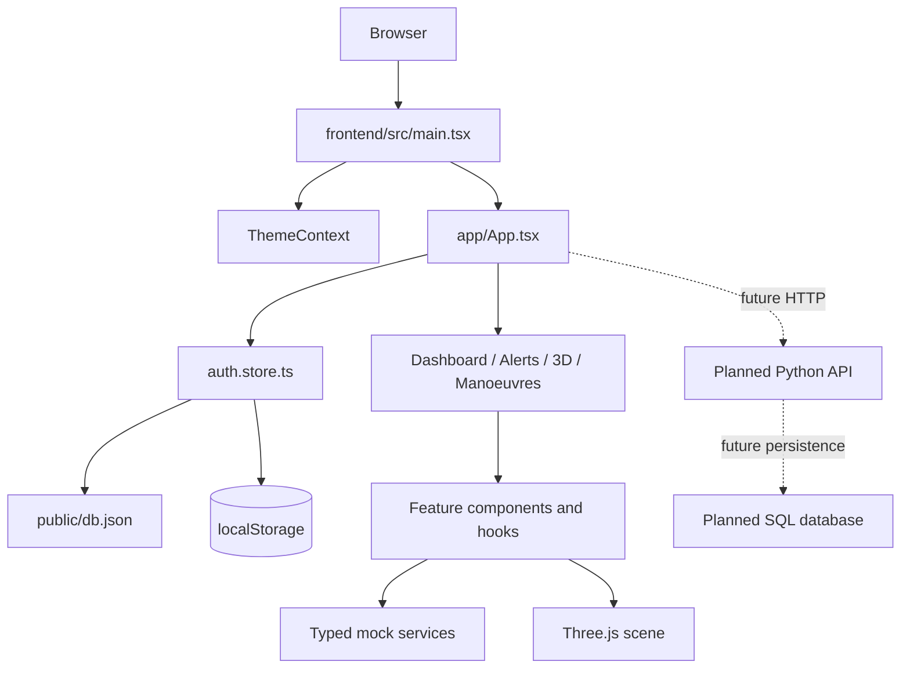

# Architecture

## Executive view

CelestIQ is currently a browser-first React application. `frontend/src/main.tsx` mounts the application, `frontend/src/app/App.tsx` owns the authenticated shell and route decisions, feature modules render the operational views, and Zustand stores hold cross-view state. The Python and SQL directories describe the intended analytical platform but do not yet participate in the running application.

!!! info "Architecture status"
	The solid path below is implemented. Dashed paths are target architecture only; they must not be read as live integrations.

## Runtime layers

### Composition and routing

`main.tsx` creates the React root, installs `BrowserRouter` and `ThemeProvider`, and imports global styles. `App.tsx` renders `LoginPage` until `isAuthenticated` is true. Once authenticated it renders `Sidebar`, `Topbar`, and the route content inside a scrollable shell.

| Path | Current behavior |
|---|---|
| `/` | Dashboard home |
| `/3d` | Orbit view for authenticated non-Guest users |
| `/alerts` | Alerts view for authenticated non-Guest users |
| `/maneuvers` | Manoeuvre comparison for authenticated non-Guest users |
| unknown path | Falls through the current route tree; a not-found page exists for future wiring |

### State and persistence

The auth store is created with Zustand. It reads the session marker `sentinel_token` and serialized user `sentinel_user` from `localStorage`. After authentication, `App.tsx` calls `initDb()`, which loads `/db.json` once and caches the user list as `sentinel_db_users`.

This is a demonstration mechanism, not an identity system. Passwords are transformed with browser `btoa`; there is no server verification, expiry, transport security boundary, or authorization service.

### Feature and data boundaries

Feature hooks and mock services keep dashboard, alert, manoeuvre, satellite, and visualization content close to their domains. The API adapter directory exists as a future replacement point, but the checked-in API client and backend entrypoint do not provide a live HTTP path.

### Visualization runtime

The orbit scene uses React Three Fiber and Drei. It loads local Earth textures, renders an Earth sphere with atmospheric layers, draws LEO/MEO/GEO paths, animates satellite markers in `useFrame`, and provides labels, selection, stars, and orbit controls. Theme state swaps the day and night Earth maps. The animation stylesheet also defines a slow pulse and scanline treatment for UI surfaces.

## Target analytical architecture

The intended future flow is ingestion -> parsing/validation -> normalization -> propagation -> conjunction screening -> risk assessment -> manoeuvre generation -> simulation -> constraints -> optimization -> API response. Each stage has a reserved package under `backend/app/`, but the modules are currently scaffolds or empty files. No claim of scientific validity should be made until models, units, uncertainty treatment, fixtures, and independent validation are implemented.

## Operational qualities and boundaries

- **Availability:** local frontend availability depends on the Vite process; no production deployment is configured.
- **Persistence:** browser localStorage only; there is no database adapter or migration system.
- **Observability:** browser console output is the available diagnostic surface; no backend logging pipeline or monitoring setup is configured.
- **Security:** prototype-only client authentication; do not use with real credentials or mission data.
- **Testing:** `npm run lint` and `npm run build` are the verifiable frontend checks. Python tests are empty in the current tree.
