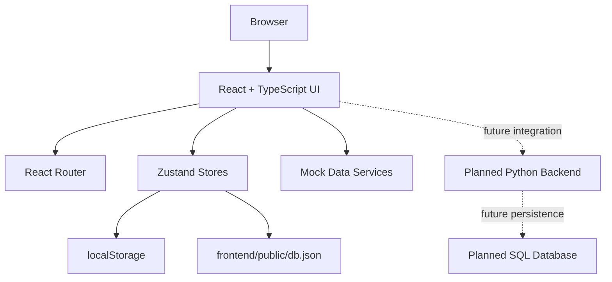

# CelestIQ

**Intelligent Collision-Avoidance Decision Support & Manoeuvre Optimisation**

One-line value: A prototype decision‑support system to analyse conjunctions, generate avoidance manoeuvres, and help operators compare safe options.

Quick links
- Docs: [docs/README.md](docs/README.md)
- Demo: [demo/DEMO_README.md](demo/DEMO_README.md) (if present)
- API contract: [docs/API_CONTRACT.md](docs/API_CONTRACT.md)

Summary
CelestIQ is an educational/research prototype that ingests orbital data, propagates orbits, detects close approaches, computes risk, generates candidate manoeuvres, simulates outcomes, and surfaces ranked recommendations via a web dashboard. It is explicitly NOT an operational flight‑safety system.

Problem
The growth of satellites and debris increases the frequency of potential conjunctions. Operators need tools to evaluate manoeuvres, estimate downstream risk, and coordinate responses.

Solution
CelestIQ implements a prototype pipeline that demonstrates ingestion, propagation, conjunction detection, risk scoring, manoeuvre generation/simulation/optimization, and a frontend dashboard for operator decision support.

Key features
- Data ingestion & normalisation for CSV/JSON demo datasets (see `data/sample/`)
- Orbit propagation and conjunction detection modules (`backend/app/orbit/`)
- Collision‑probability and risk‑scoring components (`backend/app/risk/`)
- Manoeuvre generator, simulator and optimizer (`backend/app/manoeuvre/`)
- REST‑style API scaffold (`backend/app/api/`) and static frontend (`frontend/`)
- Demo scenarios and pytest‑based tests (`tests/`)

Tech stack (verified)
- Backend: Python (project scaffold under `backend/`, FastAPI‑compatible layout)
- Frontend: React + Vite + TypeScript + Three.js (`frontend/package.json` confirms)
- Data: CSV/JSON
- DB artifacts: SQL schema in `database/`
- Testing: pytest (tests/ present)
- Optional containerisation: Docker Compose mentioned in README but not verified — Planned

Quickstart (verified)
1. Clone
   ```bash
   git clone https://github.com/Shivanshi388/CelestIQ.git
   cd CelestIQ
   ```
2. Backend venv & deps
   ```bash
   python -m venv .venv
   # Windows PowerShell
   .venv\Scripts\Activate.ps1
   pip install -r backend/requirements.txt
   ```
3. Run backend (when implemented)
   ```bash
   uvicorn backend.app.main:app --reload
   # API should appear at http://127.0.0.1:8000 when implemented
   ```
4. Serve frontend
   ```bash
   python -m http.server 5500 --directory frontend
   # open http://127.0.0.1:5500
   ```
5. Tests
   ```bash
   pytest -v
   ```

Repository structure (high level)
- `backend/` — Python backend app, API modules, risk, manoeuvre and orbit logic
- `frontend/` — static UI pages, CSS, JS and visualisation helpers
- `data/` — sample and processed data
- `database/` — schema and seed SQL files
- `docs/` — architecture, API contract, algorithms and troubleshooting
- `tests/` — pytest test files
- `demo/` — demo scenarios and sample alerts

License
No license file is present in the source repository. Current status: Not specified.

Project status
- Initial repository structure created. Backend and frontend implementation in progress.

Roadmap
See `docs/ROADMAP.md` for planned items and limitations.
# CelestIQ

**Intelligent Collision-Avoidance Decision Support and Manoeuvre Optimisation**

CelestIQ is a prototype web application for satellite-operations decision support. The repository currently contains a substantially implemented React/TypeScript frontend and a planned Python backend/database structure whose backend source files and SQL files are currently empty.

The intended workflow is to help operators review orbital/mission information, inspect alerts, visualize satellites in 3D, compare manoeuvre candidates, and eventually connect those views to real conjunction-analysis and manoeuvre-optimization services.

> **Safety notice:** CelestIQ is an educational/research prototype. It is not an operational flight-safety system and must not be used to make real spacecraft manoeuvre decisions.

## Project status

| Area | Status |
|---|---|
| React/TypeScript dashboard | **Implemented** |
| Client-side authentication prototype | **Implemented** |
| Role-based frontend route gating | **Implemented** |
| Mock satellite/alert/mission/manoeuvre data | **Implemented** |
| 3D orbit visualization frontend | **Implemented** |
| Python backend structure | **Scaffolded / Not implemented** |
| REST API | **Not implemented** |
| SQL schema | **Not implemented** |
| Real orbital propagation | **Not implemented** |
| Conjunction detection engine | **Not implemented** |
| Risk engine | **Not implemented** |
| Manoeuvre optimizer backend | **Not implemented** |
| Production authentication | **Not implemented** |
| CI/CD | **Not currently configured** |
| Docker deployment | **Not currently configured** |
| Production monitoring | **Not currently configured** |

## Problem

Satellite operators increasingly need decision support around close approaches, operational alerts, and manoeuvre trade-offs. Detecting a possible event is only part of the problem; an operator also needs understandable information for comparing possible responses.

CelestIQ is designed around that decision-support concept, with a future pipeline covering data ingestion, orbit propagation, conjunction screening, risk scoring, manoeuvre generation, simulation, constraints, optimization, and recommendation.

## Current solution

The current repository demonstrates the **operator-facing experience**:

- Authentication and account creation in the browser.
- Guest access with restricted operational views.
- Dashboard overview and live mission feed.
- Alert/risk presentation.
- Satellite status information.
- 3D orbital visualization.
- Manoeuvre comparison UI.
- Responsive UI and theme support.
- Mock data services that make the frontend demonstrable without a backend.

The planned backend structure mirrors the intended analytical pipeline but is not currently implemented.

## Technology stack

- React 18
- TypeScript 5
- Vite 5
- React Router 6
- Zustand
- Tailwind CSS
- Three.js
- React Three Fiber
- @react-three/drei
- Framer Motion
- Lucide React
- ESLint
- PostCSS / Autoprefixer

The backend directory is structured for Python, but its `requirements.txt`, `pyproject.toml`, and application modules inspected in the repository are currently empty. See [Dependencies](docs/DEPENDENCIES.md).

## Architecture



See [Architecture](docs/ARCHITECTURE.md) and [System Design](docs/SYSTEM_DESIGN.md).

## Quick start

### Prerequisites

- Node.js/npm compatible with the frontend toolchain.
- Git.

### Install

```bash
git clone https://github.com/Shivanshi388/CelestIQ.git
cd CelestIQ/frontend
npm install
```

### Development server

```bash
npm run dev
```

### Production build

```bash
npm run build
```

### Lint

```bash
npm run lint
```

The repository does not currently provide a configured Python backend runtime or a verified SQL database startup process. See [Setup](docs/SETUP.md).

## Frontend usage

The application begins at the authentication screen. Users can:

1. Sign in using the browser-side user store.
2. Create an operator account.
3. Reset a password in the local browser store.
4. Continue as Guest.
5. Use the dashboard after authentication.
6. Access the 3D visualization, alerts, and manoeuvre comparison according to the current role.

The seeded browser database contains `admin` and `operator` users. Credentials are intentionally not repeated in this documentation; inspect `frontend/public/db.json` only in a controlled development environment.

## API overview

There is currently **no implemented backend API**. The frontend contains an API-service directory, but the inspected API client file is empty. The REST endpoints described in the original repository README are therefore **planned contracts, not live endpoints**.

See [API](docs/API.md) and [API Reference](docs/API_REFERENCE.md).

## Configuration

The frontend repository includes `.env.example`, but it currently contains no variables. No application environment variables are therefore documented as required.

See [Configuration](docs/CONFIGURATION.md) and [Environment Variables](docs/ENVIRONMENT_VARIABLES.md).

## Testing

The repository contains a `tests/` directory and the original README describes a pytest strategy, but the inspected backend dependency file is empty and no CI workflow is configured.

The currently verifiable frontend quality commands are:

```bash
npm run lint
npm run build
```

See [Testing](docs/TESTING.md).

## Deployment

No production deployment platform is configured in the repository. Docker Compose is mentioned in the original README but is not present in the current root tree. Deployment instructions in this documentation therefore distinguish current frontend build capability from planned production deployment.

See [Deployment](docs/DEPLOYMENT.md).

## Security

The current authentication implementation is explicitly a browser-side prototype:

- User records originate from `frontend/public/db.json`.
- Passwords are transformed using browser `btoa`, which is encoding rather than password hashing.
- Authentication state is represented in `localStorage`.
- Route restrictions are enforced in the React application.

This is **not suitable for production authentication or authorization**.

See [Security Architecture](docs/SECURITY_ARCHITECTURE.md), [Threat Model](docs/THREAT_MODEL.md), and [Privacy](docs/PRIVACY.md).

## Documentation index

- [Project Overview](docs/PROJECT_OVERVIEW.md)
- [Architecture](docs/ARCHITECTURE.md)
- [Project Structure](docs/PROJECT_STRUCTURE.md)
- [Requirements](docs/REQUIREMENTS.md)
- [Functional Requirements](docs/FUNCTIONAL_REQUIREMENTS.md)
- [Non-Functional Requirements](docs/NON_FUNCTIONAL_REQUIREMENTS.md)
- [Setup](docs/SETUP.md)
- [Development](docs/DEVELOPMENT.md)
- [Configuration](docs/CONFIGURATION.md)
- [Environment Variables](docs/ENVIRONMENT_VARIABLES.md)
- [API](docs/API.md)
- [API Reference](docs/API_REFERENCE.md)
- [Data Flow](docs/DATA_FLOW.md)
- [Database](docs/DATABASE.md)
- [Authentication](docs/AUTHENTICATION.md)
- [Authorization](docs/AUTHORIZATION.md)
- [System Design](docs/SYSTEM_DESIGN.md)
- [Design Decisions](docs/DESIGN_DECISIONS.md)
- [Components](docs/COMPONENTS.md)
- [Modules](docs/MODULES.md)
- [Integrations](docs/INTEGRATIONS.md)
- [Dependencies](docs/DEPENDENCIES.md)
- [UI/UX](docs/UI_UX.md)
- [User Flows](docs/USER_FLOWS.md)
- [Testing](docs/TESTING.md)
- [Test Strategy](docs/TEST_STRATEGY.md)
- [Error Handling](docs/ERROR_HANDLING.md)
- [Troubleshooting](docs/TROUBLESHOOTING.md)
- [FAQ](docs/FAQ.md)
- [Deployment](docs/DEPLOYMENT.md)
- [CI/CD](docs/CI_CD.md)
- [Monitoring](docs/MONITORING.md)
- [Performance](docs/PERFORMANCE.md)
- [Scalability](docs/SCALABILITY.md)
- [Security Architecture](docs/SECURITY_ARCHITECTURE.md)
- [Threat Model](docs/THREAT_MODEL.md)
- [Privacy](docs/PRIVACY.md)
- [Release Process](docs/RELEASE_PROCESS.md)
- [Versioning](docs/VERSIONING.md)
- [Roadmap](docs/ROADMAP.md)

## Contributing

See [CONTRIBUTING.md](CONTRIBUTING.md).

## License

No license is currently specified in the repository. See [LICENSE](LICENSE).
