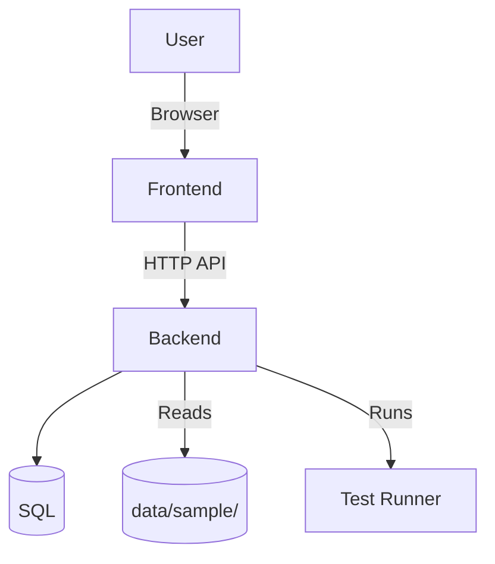
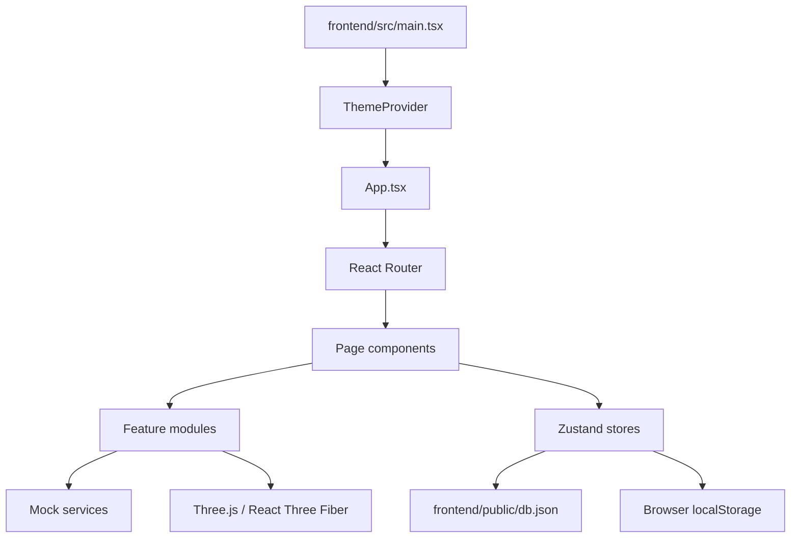
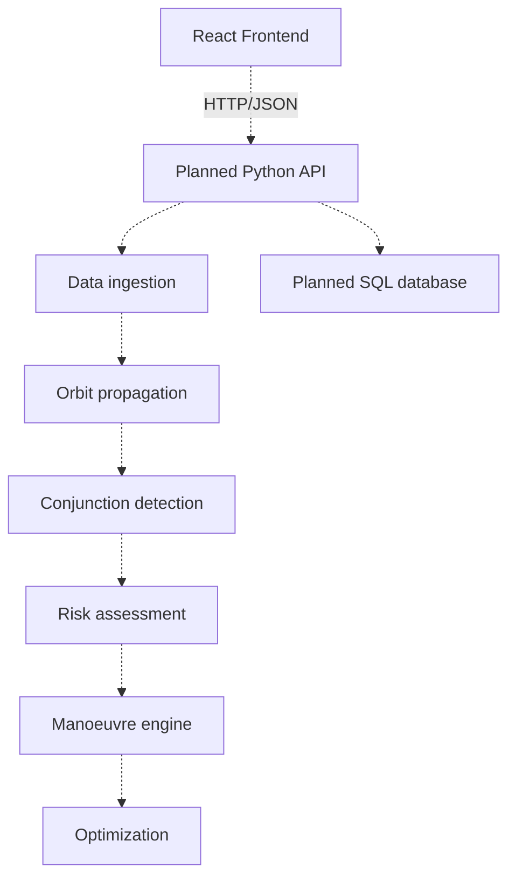

# Architecture

Purpose: describe the implemented/proposed architecture.

Architecture style
- Client‑server, modular monolith (backend Python app serving REST endpoints + static frontend).

High‑level diagram

Major components
- Frontend (`frontend/`): React + Vite UI, orbit visualisations using Three.js (`@react-three/fiber`).
- Backend (`backend/app/`): API + domain modules:
  - Data ingestion: parser/validator/normalizer
  - Orbit propagation & conjunction detection
  - Risk scoring & collision probability (prototype)
  - Manoeuvre generator/simulator/optimizer
  - Services for decision support, alerts, reports
- Database: SQL schema in `database/` for storing objects, conjunctions and reports.
- Tests: pytest suite for backend units under `tests/`.

Request lifecycle (typical)
1. User requests dashboard → Frontend fetches conjunction list via API.
2. Backend `GET /conjunctions` reads processed data or queries DB.
3. User requests manoeuvre generation → Frontend POSTs to `/manoeuvres/generate`.
4. Backend generates candidates, returns simulated profiles and scores.

Error & failure flow
- Input validation failures: return HTTP 4xx (planned).
- Backend processing errors: return 5xx and log details (see `backend/app/utils/logging.py` if present).
- Data source missing/stale: flagged in UI and logs.

Security & deployment (summary)
- Authentication not observed in root audit — mark as Not implemented (see `docs/AUTHENTICATION.md`).
- Secrets: `.env.example` present; `.env` should be used for runtime secrets.
# Architecture

## Status

**Current architecture:** React/TypeScript single-page frontend with browser-local state and mock data.

**Planned architecture:** React frontend + Python analytical services + SQL persistence.

## Current architecture

`main.tsx` creates the React root, wraps the application in `BrowserRouter` and `ThemeProvider`, and loads global styles. `App.tsx` controls authentication gating and the main application routes.

## Route layer

The current application defines:

| Route | Current behavior |
|---|---|
| `/` | Dashboard home |
| `/3d` | Orbit view; blocked for Guest |
| `/alerts` | Alerts view; blocked for Guest |
| `/maneuvers` | Manoeuvre view; blocked for Guest |

The application redirects unauthenticated users to the login screen by rendering `LoginPage` instead of the main shell.

## State layer

Zustand is used for application state. The inspected authentication store manages:

- Authentication status.
- Current user.
- Browser-side user list.
- Database initialization.
- Login.
- Signup.
- Password changes.
- Guest login.
- Logout.

Other stores exist for UI and visualization state.

## Data layer

The frontend currently consumes:

- Static/mock TypeScript data modules.
- `frontend/public/db.json` for user seed data.

There is no active database adapter in the current implementation.

## Visualization

The frontend uses Three.js through React Three Fiber and `@react-three/drei`. The visualization feature is separated into pages/components and is intended to present orbital information interactively.

## Planned backend architecture

The repository structure reserves modules for:

- API routes.
- Data ingestion and normalization.
- Orbit propagation and conjunction detection.
- Risk scoring and prioritization.
- Manoeuvre generation, simulation, constraints, and optimization.
- Decision-support services.
- Reporting.
- Optional ML.

These modules are **not currently implemented**.

## Deployment architecture

No deployment architecture is currently configured in the repository. Docker Compose is mentioned in the original README but no root-level `docker-compose.yml` is present in the current repository tree.
