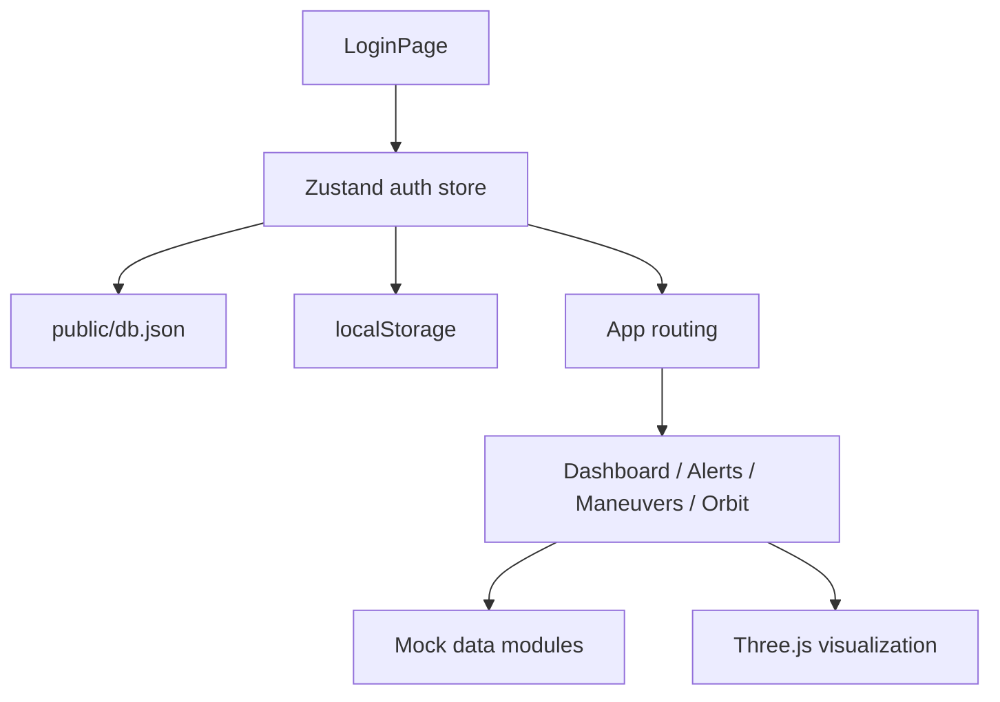

# Data Flow

## Current frontend data flow

### Authentication data

1. `LoginPage` receives username/password.
2. `auth.store.ts` initializes users from `/db.json` when no browser user database exists.
3. Password values are transformed using `btoa`.
4. The user list is stored in localStorage.
5. Successful login stores a simple session marker and serialized user.
6. `App.tsx` reads authentication state and chooses login vs application shell.

## Mock operational data

Mock modules provide typed data for:

- Alerts.
- Mission events/system status.
- Manoeuvres.
- Satellites.

## Planned analytical data flow

```mermaid
flowchart LR
    Input["Orbital / mission input"]
    Ingest["Ingestion"]
    Normalize["Validation + normalization"]
    Prop["Propagation"]
    Conj["Conjunction screening"]
    Risk["Risk assessment"]
    Candidates["Candidate manoeuvres"]
    Sim["Simulation"]
    Optimize["Optimization"]
    API["Planned API"]
    UI["Dashboard"]

    Input -.-> Ingest
    Ingest -.-> Normalize
    Normalize -.-> Prop
    Prop -.-> Conj
    Conj -.-> Risk
    Risk -.-> Candidates
    Candidates -.-> Sim
    Sim -.-> Optimize
    Optimize -.-> API
    API -.-> UI
```

Dashed edges indicate planned functionality.
