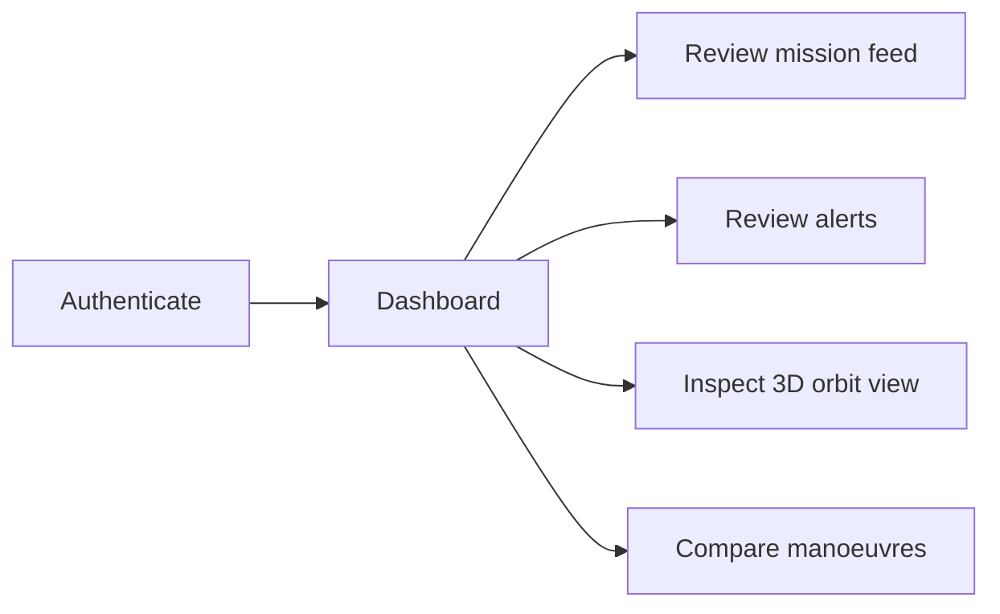

# Project Overview

Purpose
CelestIQ is a prototype decision‑support tool for satellite conjunction analysis and manoeuvre optimisation.

Target users
- Satellite operators
- Flight dynamics engineers
- Researchers and students

Scope
Implemented (verified)
- Backend code scaffolding under `backend/app/` (ingestion, orbit, risk, manoeuvre).
- Frontend scaffold built with React + Vite + TypeScript (`frontend/`).
- Sample data in `data/` and demo scenarios in `demo/`.
- SQL schema files in `database/`.
- Unit test scaffolding under `tests/`.

Planned / Not implemented
- Full, validated collision‑probability calibration and authoritative data integrations.
- Operational spacecraft command interfaces (explicitly Not Applicable).

Core workflows
1. Load sample orbital & object data (`data/sample/`).
2. Propagate orbits (backend).
3. Detect conjunctions.
4. Score risk and prioritise alerts.
5. Generate and simulate candidate manoeuvres.
6. Present results in a dashboard for operator review.

Current project status
- Repository scaffold exists; many modules present but require implementation and validation for production use.
# Project Overview

## Purpose

CelestIQ is a prototype command-dashboard application for space-operations decision support. Its intended purpose is to present satellite state, alerts, orbital visualization, and manoeuvre comparison in a single operator-oriented interface.

The repository's current implementation is primarily frontend-focused. The analytical backend described by the repository architecture is scaffolded but not implemented.

## Problem being addressed

The project targets a space-situational-awareness decision-support scenario in which operators need to interpret close-approach alerts and compare possible responses. The intended product goes beyond alert display by eventually evaluating manoeuvre candidates against safety, mission, and resource constraints.

## Target users

The repository documentation identifies the following conceptual users:

- Mission control officers.
- Satellite operators.
- Mission analysts.
- Decision makers.

The current UI explicitly models at least `Admin`, `Operator`, and `Guest` roles.

## Objectives

### Implemented

- Provide an operator-style dashboard.
- Present mission events and alerts.
- Present satellite information.
- Provide a 3D orbital visualization.
- Provide manoeuvre comparison views.
- Provide browser-side account/session flows.

### Planned

- Connect the frontend to a real analytical backend.
- Add orbital data ingestion.
- Add propagation and conjunction detection.
- Add risk assessment.
- Add manoeuvre generation and optimization.
- Persist analytical results in SQL.
- Add production-grade authentication and authorization.

## Scope

### In scope

- Frontend dashboard.
- Navigation and route protection.
- Mock operational data.
- Authentication prototype.
- 3D visualization.
- Alert and manoeuvre views.
- TypeScript data models and frontend stores.

### Out of scope for the current implementation

- Spacecraft command and control.
- Authoritative conjunction assessment.
- Operational collision probability certification.
- Production identity management.
- Real-time external orbital-data ingestion.
- Production SQL persistence.
- Backend REST services.

## Core workflow

The broader analytical workflow is documented as planned architecture rather than current execution.

## Current status

The repository is best characterized as a **frontend prototype with a backend/database scaffold**. The frontend has real React/TypeScript implementation, routing, stores, reusable components, mock data, and visualization code. The Python backend files and SQL files are placeholders at the current revision.

## Future direction

The next architectural step is to replace browser-side mock services with a validated backend while retaining the existing operator-facing UX. The backend should be introduced behind stable API contracts so the frontend can transition from mock data to live services without redesigning the entire UI.
