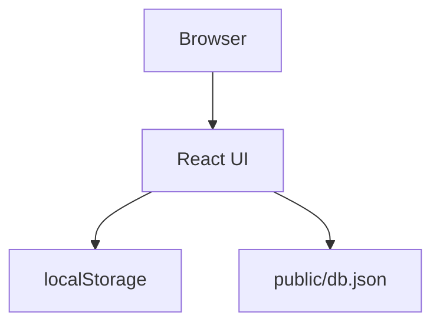

# Security Architecture

Implemented
- Minimal guidance for secrets via `.env.example`.

Recommended
- Add authentication, HTTPS, input validation, dependency scanning, and a secrets manager for production.
# Security Architecture

## Current security boundaries

The current application has only a browser security boundary.

There is no trusted server boundary.

## Authentication

Authentication is client-side and uses browser storage. See [Authentication](AUTHENTICATION.md).

## Authorization

Protected routes are gated by the client-side `role` value. See [Authorization](AUTHORIZATION.md).

## Secret management

No production secret-management mechanism is configured.

## Input validation

The login form validates required values. The broader application does not currently expose a server-side validation layer because no backend exists.

## Dependency security

Dependencies are pinned through the npm lockfile, but no automated dependency scanning workflow is configured.

## Security limitations

The current design must not be treated as production-secure because:

- Credentials are delivered to the browser.
- Password encoding is reversible.
- Session state is client-controlled.
- No backend authorization exists.

## Future security architecture

A production implementation should introduce a trusted backend boundary, secure password hashing, secure session/token management, server-side authorization, input validation, audit logging, HTTPS, and dependency/security scanning.
