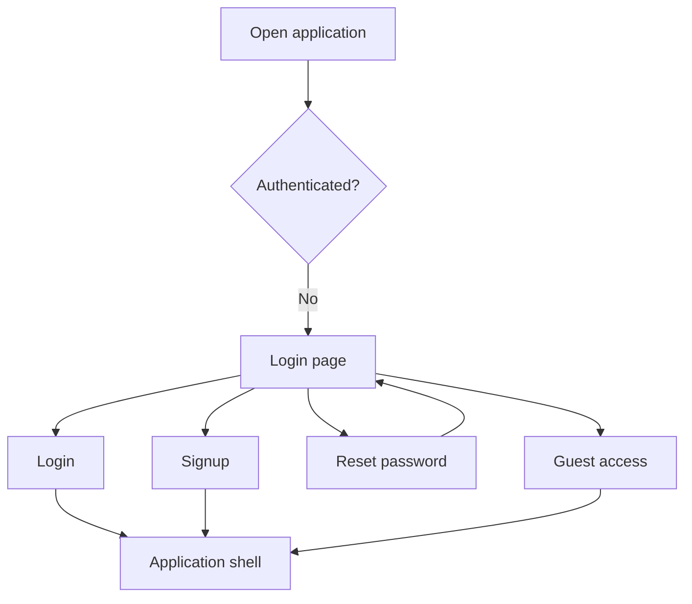
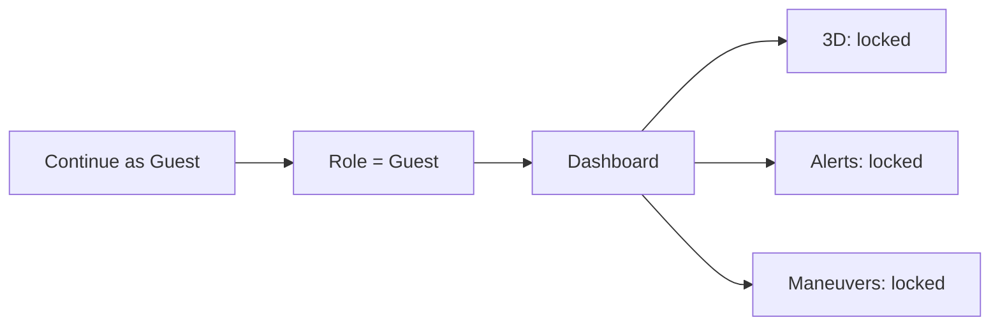
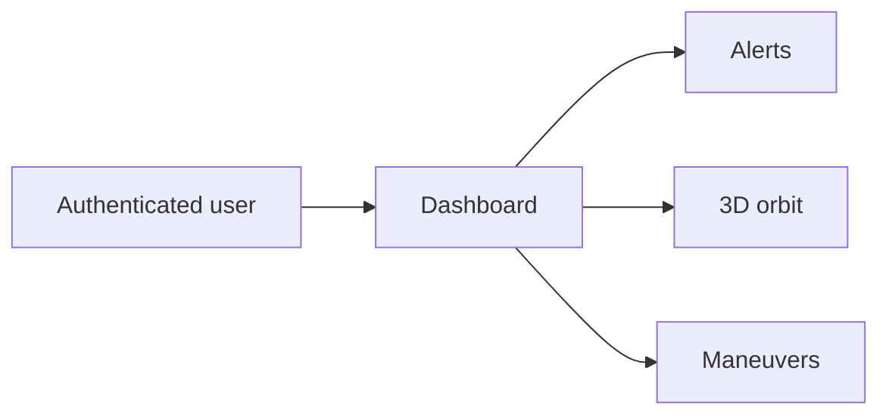
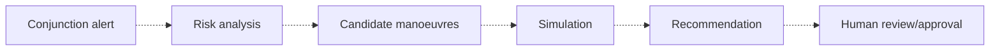

# User Flows

Example: Assessing a conjunction
```mermaid
flowchart LR
  User --> Frontend: Open dashboard
  Frontend --> Backend: GET /conjunctions
  User --> Frontend: Select conjunction
  Frontend --> Backend: POST /manoeuvres/generate
  Backend --> Frontend: Candidate list
  User --> Frontend: Simulate / compare
  User --> Frontend: Approve (manual)
```
# User Flows

## Authentication



## Guest access



## Authorized operator flow



## Future operational flow



The future flow is not currently executable because the analytical backend is not implemented.
