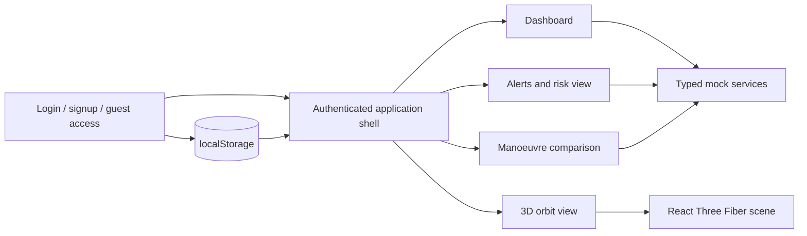

# CelestIQ

## Orbital intelligence, presented as a decision-support prototype

CelestIQ is a React-based operator experience for reviewing mission status, exploring alert context, inspecting a 3D orbital scene, and comparing manoeuvre options. The repository also reserves a Python analytical backend and SQL persistence layer for future implementation.

!!! danger "Operational boundary"
    CelestIQ is an educational and research prototype. It does not control spacecraft, provide validated flight-safety advice, or replace authoritative conjunction-assessment services.

## Read this first

| Signal | Meaning in this repository |
|---|---|
| **Implemented** | Verified in the checked-in source and suitable for local demonstration. |
| **Scaffolded** | Directory or filename exists, but the executable behavior is incomplete or empty. |
| **Planned** | Describes the target product direction, not a current capability. |

The implemented product is the frontend. It is a Vite application with React 18, TypeScript, React Router, Zustand, Tailwind CSS, Three.js, React Three Fiber, Framer Motion, and Lucide React. Authentication, operational views, and satellite content are browser-local/mock experiences. The Python API, analytical modules, SQL files, and pytest files are present as structure but are not currently executable implementations.

## Experience map



## Capability status

| Capability | Status | Evidence |
|---|---|---|
| Vite development server and production build | **Implemented** | `frontend/package.json` scripts |
| Login, signup, password update, logout | **Implemented prototype** | `frontend/src/store/auth.store.ts` |
| Guest route restrictions | **Implemented prototype** | `frontend/src/app/App.tsx` |
| Dashboard, alerts, manoeuvre views | **Implemented UI** | `frontend/src/pages/`, `frontend/src/features/` |
| 3D Earth, orbit paths, markers, labels, controls | **Implemented UI** | `frontend/src/features/visualization/` |
| Mock mission, alert, satellite, manoeuvre data | **Implemented** | `frontend/src/services/mock/` |
| CSV file loading | **Implemented utility** | `backend/app/data/ingestion.py` |
| HTTP API | **Scaffolded, not implemented** | `backend/app/api/`, empty `main.py` |
| Propagation, conjunction, risk, optimization | **Scaffolded, not implemented** | `backend/app/orbit/`, `risk/`, `manoeuvre/` |
| Relational database | **Not implemented** | Empty `database/*.sql` |
| Automated Python tests | **Not implemented** | Empty `tests/*.py` and no Python dependency setup |

## Quick start

### Prerequisites

- Node.js and npm compatible with the versions in `frontend/package.json`.
- Git, if cloning the repository.

### Run the frontend

```powershell
cd frontend
npm install
npm run dev
```

Open the local URL printed by Vite. For a production verification:

```powershell
npm run lint
npm run build
```

The backend cannot be started from the current revision: `backend/requirements.txt`, `backend/pyproject.toml`, and `backend/app/main.py` do not define a runnable service.

## Repository at a glance

```text
CelestIQ/
├── backend/app/       Python analytical/API scaffolding; CSV ingestion has a real utility
├── data/               Sample CSV locations and processed-data placeholder
├── database/           Future SQL schema, seed, and query locations
├── demo/               Future/demo scenario locations
├── docs/               This documentation set
├── frontend/           Implemented React/Vite operator experience
└── tests/              Future Python test locations
```

See [Project Structure](Detailed_docs/PROJECT_STRUCTURE.md) for the file-level map and [Architecture](ARCHITECTURE.md) for the current and target boundaries.

## Documentation routes

- **Build and run:** [Getting Started](Detailed_docs/GETTING_STARTED.md), [Configuration](Detailed_docs/CONFIGURATION.md), [Dependencies](Detailed_docs/DEPENDENCIES.md)
- **Understand the system:** [Architecture](ARCHITECTURE.md), [Data Flow](Detailed_docs/DATA_FLOW.md), [Components](Detailed_docs/COMPONENTS.md)
- **Use the UI:** [User Flows](Detailed_docs/USER_FLOWS.md), [UI/UX](Detailed_docs/UI_UX.md), [Demo Script](DEMO_SCRIPT.md)
- **Future analytical contract:** [API Contract](API_CONTRACT.md), [Algorithms](ALGORITHM.md), [Data Sources](DATA_SOURCES.md)
- **Contribute safely:** [Testing](Detailed_docs/TESTING.md), [Security](SECURITY.md), [Limitations](Detailed_docs/LIMITATIONS.md), [Roadmap](Detailed_docs/ROADMAP.md)

## Documentation maintenance rule

Every page must label claims as current, scaffolded, or planned. When source behavior changes, update the relevant evidence path and the status table before expanding the narrative. This keeps a polished documentation experience honest enough for engineering use.
